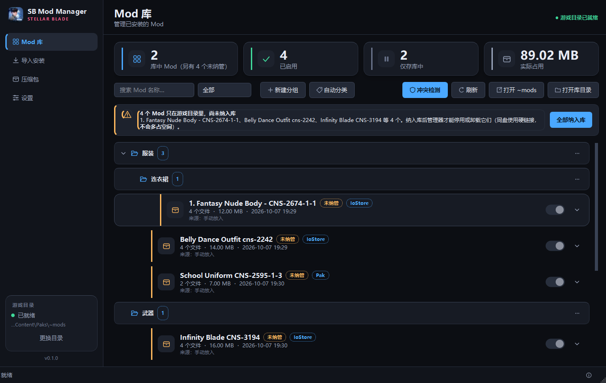
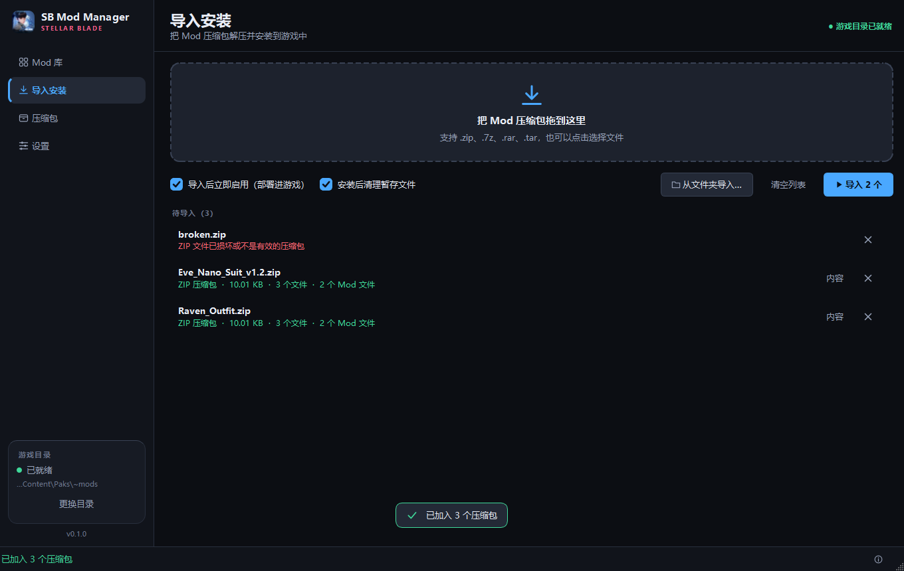
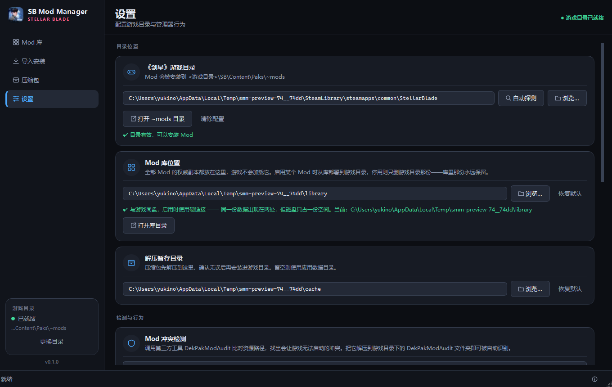
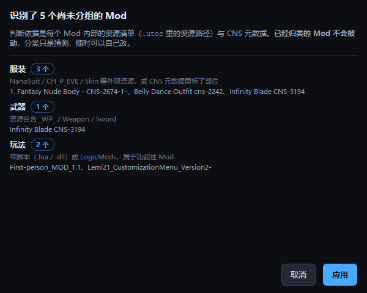
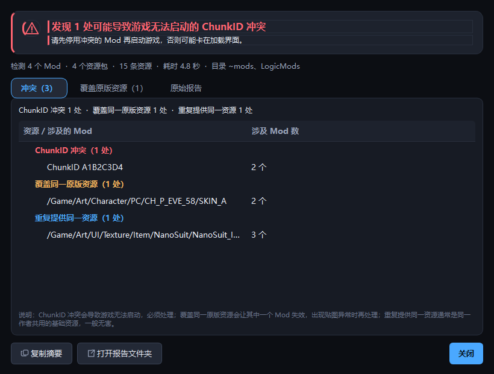
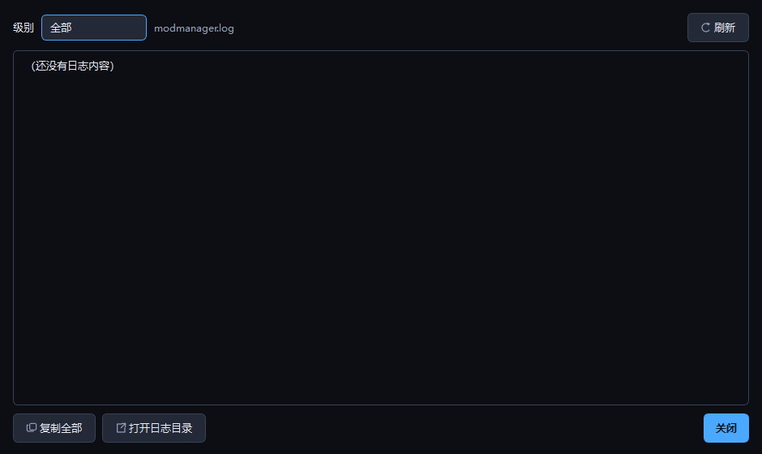
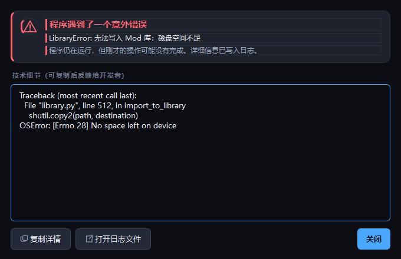

# SB Mod Manager

《剑星》(Stellar Blade) 的图形化 Mod 管理器 —— 把 Mod 压缩包拖进来，自动解压、
纳入库、按内容分类，需要时再部署进游戏目录。

- **技术栈**：Python 3.11 + PySide6 (Qt 6) + uv
- **目标平台**：Windows
- **界面语言**：简体中文
- **许可证**：[MIT](LICENSE)

> ### 免责声明
>
> 这是**非官方**的第三方工具，与 Shift Up、Sony Interactive Entertainment 及
> 《剑星》(Stellar Blade) 的发行方没有任何隶属或背书关系。
>
> 游戏名称、相关美术资源与商标归各自权利人所有。本工具不包含、也不分发任何
> 游戏本体文件或 Mod 文件，只在用户自己的机器上读写用户自己安装的内容。
>
> 使用本工具修改游戏文件的风险由使用者自行承担。**建议先备份存档与 Mod 目录。**

## 界面预览

所有截图由 `tools/preview.py` 在沙箱里自动生成，与当前代码保持一致。

| Mod 库（分组层级列表） | 导入安装 |
|---|---|
|  |  |

| 压缩包 | 设置 |
|---|---|
|  |  |

| 按内容自动分类（先预览、确认后才写回） | 冲突检测结果 |
|---|---|
|  |  |

| 运行日志（`F12` 随时打开） | 未捕获异常的提示 |
|---|---|
|  |  |

---

## 1. 游戏目录约定

《剑星》基于虚幻引擎，Mod 以资源包形式被引擎递归挂载。安装位置固定为：

```
<游戏根目录>\SB\Content\Paks\~mods\
```

`~mods` 前面的波浪号不能省略。正式版目录名为 `StellarBlade`，试玩版为 `StellarBladeDemo`：

```
SteamLibrary\steamapps\common\StellarBlade\SB\Content\Paks\~mods
```

管理器会自动读注册表定位 Steam，解析 `libraryfolders.vdf` 找到全部库，再兜底扫描盘符；
也可以在「设置」里手动指定（选中游戏根目录、`SB` 子目录或 `Paks` 目录都能被识别）。

---

## 2. 项目结构

采用 **src 布局** 的三层架构：`core`（纯逻辑）→ `services`（Qt 胶水）→ `ui`（界面）。
依赖方向严格单向，`core` 不导入任何 Qt，因此可以脱离界面单独测试。

```
ModManager/
├── pyproject.toml              # 项目元数据、依赖、pytest 配置
├── README.md
├── .gitignore
├── uv.lock                     # 依赖锁定，保证换机器装出同一套版本
│
├── src/stellar_mod_manager/
│   ├── __init__.py             # 版本号、应用名、功能开关（翻译入口）
│   ├── __main__.py             # python -m stellar_mod_manager 入口
│   ├── app.py                  # QApplication 装配、日志启动、首次探测游戏目录
│   ├── logging_setup.py        # 日志、会话头、全局异常钩子、Qt 消息接管
│   ├── assets/
│   │   ├── icon.png            # 应用图标 256×256（取自游戏 exe）
│   │   └── icon.ico            # 多尺寸图标，给任务栏 / 标题栏 / 文件管理器用
│   │
│   ├── core/                   # ← 纯逻辑层，零 Qt 依赖，可独立测试
│   │   ├── models.py           # 领域模型：Mod / ModFile / ArchiveInspection / PayloadKind…
│   │   ├── paths.py            # 游戏目录探测、应用数据目录、静态资源定位、Steam 库解析
│   │   ├── config.py           # 用户配置的 JSON 持久化（容错读取 + 原子写入）
│   │   ├── groups.py           # ★ Mod 分组树：层级、归属、成环与重名保护、容错
│   │   ├── classify.py         # ★ 按 Mod 内部资源清单猜分类（读 .utoc / .dekcns.json）
│   │   ├── archive.py          # ★ 压缩包引擎：格式判定、安全解压、进度回调
│   │   ├── library.py          # ★ Mod 库：入库、部署（硬链接）、启停、纳管、迁移
│   │   ├── audit.py            # ★ 冲突检测：调用 DekPakModAudit 并归类冲突
│   │   ├── translate.py        # ★ 翻译：宽容扫描 .dekcns.json、缓存、OpenAI 兼容客户端
│   │   └── formatting.py       # 字节数 / 时长等展示格式化
│   │
│   ├── services/               # ← 胶水层：把 core 接到 Qt 上
│   │   ├── worker.py           # Task(QThread) + TaskManager：后台任务与进度信号
│   │   └── context.py          # AppContext：配置 + ModLibrary + GroupTree + 任务管理器
│   │
│   └── ui/                     # ← 界面层
│       ├── theme.py            # 配色 Palette、间距刻度、全局 QSS、勾号生成
│       ├── icons.py            # 用 QPainter 现画的矢量图标（无外部图片资源）
│       ├── main_window.py      # 主窗口 + 冲突检测的编排
│       ├── dialogs/
│       │   ├── conflict_dialog.py  # ★ 冲突检测结果对话框
│       │   ├── classify_dialog.py  # ★ 自动分类的预览与确认
│       │   ├── group_dialog.py     #   分组的新建 / 重命名
│       │   ├── error_dialog.py     #   未捕获异常的友好提示（跨线程投递）
│       │   ├── log_dialog.py       #   内置日志查看器（按级别筛选）
│       │   ├── translate_dialog.py #   翻译预览/编辑/写回（入口当前关闭）
│       │   └── tool_setup_dialog.py# ★ 缺工具时的三步引导安装
│       ├── widgets/            # 可复用组件
│       │   ├── common.py       #   Card / StatCard / Badge / EmptyState / 按钮工厂
│       │   ├── sidebar.py      #   左侧导航 + 游戏目录状态卡
│       │   ├── switch.py       #   带动画的启用/停用开关
│       │   ├── group_row.py    #   ★ 分组行（层级列表的父节点）
│       │   ├── mod_card.py     #   Mod 列表项（可缩进、可分组）
│       │   ├── drop_zone.py    #   压缩包拖放区
│       │   └── toast.py        #   浮层提示
│       └── pages/              # 四个功能页
│           ├── base.py         #   页面基类与共用布局工具
│           ├── library_page.py #   Mod 库：分组树、统计、搜索、筛选、启停、分类、冲突检测
│           ├── import_page.py  #   ★ 导入安装：解压 + 安装的完整流程
│           ├── archives_page.py#   ★ 压缩包：批量查看与解压
│           └── settings_page.py#   设置
│
├── tests/                      # 289 项 pytest 测试（当前 3 项因翻译入口关闭而跳过）
│   ├── conftest.py             # 离屏 Qt、假游戏目录、隔离的应用数据目录
│   ├── test_archive.py         # 39 项：格式判定、路径净化、解压、安全性
│   ├── test_library.py         # 48 项：入库、硬链接部署、启停、纳管、伴随文件、批量导入、迁移
│   ├── test_groups.py          # 31 项：分组树、嵌套、成环与重名保护、容错、持久化
│   ├── test_classify.py        # 23 项：按资源清单与 CNS 元数据分类的规则
│   ├── test_translate.py       # 50 项：宽容解析、逐字节幂等、引用保护、写回安全、OpenAI 客户端
│   ├── test_audit.py           # 26 项：工具定位、报告解析、冲突归类、异常路径
│   ├── test_ui_smoke.py        # 47 项：界面构建、信号接线、设置同步、各对话框
│   ├── test_ui_groups.py       # 21 项：层级渲染、折叠、搜索强制展开、移动与删除、批量任务接线
│   └── test_paths_config.py    # 目录探测与配置容错
│
├── docs/
│   ├── screenshots/            # README 用图，由 tools/preview.py 生成
│   └── 验收测试清单.md          # 面向真实数据的手工验收步骤
│
└── tools/
    ├── preview.py              # 沙箱渲染各页面与对话框，导出文档截图
    └── make_icon.py            # 由一张源图生成 assets/ 下的 icon.png + icon.ico
```

★ = 核心实现

---

## 3. 分层职责

### `core` — 纯逻辑，可脱离界面测试

| 模块 | 职责 |
|---|---|
| `paths.py` | 一切「东西放在哪」的问题。注册表 → `libraryfolders.vdf` → 盘符扫描三级探测；`find_game_root()` 能把用户随手选中的路径还原成游戏根目录 |
| `config.py` | 配置读写。文件损坏、字段缺失、类型不符都回退到默认值 —— 配置坏了不该让程序打不开 |
| `archive.py` | 压缩包引擎。格式以**魔术字节**判定而非扩展名；解压前逐条净化路径；统一回报进度 |
| `library.py` | Mod 库的全部增删查改。**文件系统是唯一事实来源**，不依赖数据库 |
| `models.py` | 纯数据结构，`dataclass(slots=True)`，无副作用 |

### `services` — Qt 胶水

- `worker.Task`：`QThread` 子类，把耗时函数丢到后台线程，通过 `progressed` / `succeeded` / `failed` / `cancelled_signal` 四个信号把结果送回主线程。工作函数收到 `Task` 本身，可调用 `task.report()` 上报进度、检查 `task.cancelled` 响应取消。
- `context.AppContext`：单例式的全局状态。切换游戏目录时重建 `ModLibrary` 并广播 `game_root_changed`，各页面只需连信号即可保持同步。

### `ui` — 界面

- 颜色全部走 `theme.Palette`，页面里不写死色值；换主题时重建界面树。
- 图标由 `icons.py` 用 `QPainter` 在 24×24 逻辑坐标系里现画，2 倍超采样，**不依赖图标字体或图片资源**。
- `MainWindow` 负责导航、状态栏与浮层提示，四个页面各自独立、互不引用。

---

## 4. 关键设计决策

### 4.1 以文件系统为唯一事实来源

Mod 库不维护数据库。扫描 `~mods` 与停用目录即可得出全部状态，因此：

- 用户在资源管理器里手动增删 Mod 后，界面刷新一次就是对的；
- 不存在「数据库与磁盘不一致」这类需要修复的状态；
- 唯一持久化的元数据是「来源压缩包」（`mod_sources.json`），丢失只影响显示，不影响功能。

### 4.2 存储模型：库是权威副本，游戏目录只是部署目标

虚幻引擎会**递归挂载** `Content/Paks` 下的所有 pak。所以「停用」不能靠在 `~mods` 里
改扩展名或挪进子目录——那样引擎照样会加载；文件必须离开 `Paks` 目录树。

本管理器用**仓库模型**解决这个问题：

```
D:\...\steamapps\common\
├── StellarBlade\SB\Content\Paks\~mods\      ← 部署目标：只放已启用的 Mod
│   ├── Eve_Nano_Suit\                          （游戏会加载这里的一切）
│   └── Raven_Outfit\
└── StellarBladeModLibrary\                  ← 库：全部 Mod 的权威副本
    ├── Eve_Nano_Suit\                          （在 Paks 树之外，游戏不碰）
    ├── Raven_Outfit\
    └── SomeMod_You_Disabled\                ← 停用的留在这里，随时能开回来
```

* **入库**：Mod 一律先进库，库是权威副本；
* **启用**：从库部署到 `~mods`；
* **停用**：只删 `~mods` 里那一份，**库中原封不动**；
* **删除**：才真正从库中移除。

所以「下载了很多、只用几个」是天然的用法：全部入库，只启用你要的那几个，
其余留在库里，游戏完全不碰，也**不会丢文件**。

#### 为什么用硬链接，以及为什么库要跟游戏同盘

部署时优先使用**硬链接**（`os.link`）：同一份数据同时出现在库和 `~mods` 里，
但磁盘上**只占一份空间**；删掉任意一侧，另一侧依然完好。

硬链接要求两者在同一个卷上，所以库默认放在游戏目录的**同级目录**。
跨卷、或文件系统不支持硬链接（exFAT 等）时自动退回复制，此时才真的占两份空间——
界面上会如实标出「硬链接（不额外占空间）」还是「复制（额外占用一倍空间）」。

#### 手动放进 `~mods` 的 Mod 怎么办

它们对管理器来说是**未纳管**状态：管理器不知道它们从哪来，也无法停用它们
（停用会让文件无处可去）。库页面会显著提示，并提供「纳入库」——
同盘时用硬链接完成，**不额外占空间**，游戏目录里的文件照常工作。

### 4.3 解压安全

从各处下载来的 Mod 压缩包不可信，`archive.py` 因此：

1. **拒绝路径穿越**：含 `..`、绝对路径、盘符、UNC、NTFS 数据流（`:`）或 Windows 保留设备名（`CON`/`NUL`…）的条目一律跳过并记入 `skipped`；
2. **拒绝链接**：tar 的符号链接/硬链接/设备文件、zip 与 7z 的 symlink 条目不还原 —— 它们能间接写到目标目录之外；
3. **不信任扩展名**：格式看魔术字节，扩展名只在魔术字节无法判定时兜底。

对绝对路径采取「拒绝」而非「静默改写成相对路径」：正常的 Mod 压缩包不会出现绝对路径，
出现即说明归档本身可疑。

### 4.4 Mod 的「内容」不只有 pak

部署时**不能只搬 `.pak/.utoc/.ucas`**。CNS 系列 Mod 会把注册元数据
`Xxx.dekcns.json` 放在 pak 旁边，少了它整个 Mod 就失效；`ModFile` 因此按
「目录下的全部文件，减去明确的装饰性文件（截图、快捷方式）」来收集内容，
只有**判断「这是不是一个 Mod」**时才要求存在有效载荷。

这个区分很关键：早先的实现只认 pak 后缀，一旦启用/停用某个 Mod 就会把
`.dekcns.json` 删掉且再也恢复不了——测试里专门留了回归用例守着这条。

### 4.5 安装时剥掉冗余外层目录

Mod 压缩包常见三种布局，入库后都应得到 `<库>/<Mod 名>/<文件>`：

```
MyMod.pak                                  入库后 →  MyMod/MyMod.pak
~mods/MyMod/MyMod.pak                                →  MyMod/MyMod.pak
SB/Content/Paks/~mods/MyMod/MyMod.pak                →  MyMod/MyMod.pak
```

做法是取全部有效载荷文件的**公共父目录**作为内容根，剥掉它之后再入库。
`~mods/<Mod 名>/` 这层由部署步骤重建，因此不会出现 `~mods/MyMod/MyMod/MyMod.pak`
这种套娃。

注意：**只有入库/纳管时**才用公共父目录推断内容根；把已在游戏目录里的 Mod
纳管进库时，必须用「它在 `~mods` 里占据的那个文件夹」作基准，否则当文件都放在
一层子目录里时（`~mods/X/装备名/X.utoc`）会多剥一层，库里的结构与游戏目录对不上。

### 4.6 松散文件按主名归组

`MyMod.pak` / `MyMod.utoc` / `MyMod.ucas` / `MyMod.sig` 是同一个 Mod 的四个组成部分，
扫描时按主名归为一组；界面据此显示 `Pak` 或 `IoStore` 格式标签。

### 4.7 冲突检测：集成 DekPakModAudit

「游戏进不去」最常见的原因不是 Mod 本身有问题，而是 Mod 之间在 IoStore 层撞了车。
这部分能力交给第三方开源工具 **DekPakModAudit** 完成 —— 它读取游戏原版 pak 与 Mods
目录下每个 `.utoc`，逐条比对虚幻资源路径。本管理器负责调用它、解析结果并把结论讲清楚。

**三类冲突，后果完全不同：**

| 类型 | 判定 | 后果 | 处理建议 |
|---|---|---|---|
| **ChunkID 冲突** | 两个 `.utoc` 的 `ChunkID` 相同 | **游戏无法启动** | 必须停用其中一个 |
| **覆盖同一原版资源** | 同一原版资源被多个 Mod 提供 | 只有一个生效，可能贴图错乱 | 只保留想要的那个 |
| **重复提供同一资源** | 同一新增资源被多个 Mod 提供 | 通常无害（同作者共用基础资源） | 出现异常时再处理 |

判定口径与工具自身一致：资源路径被**多于一个** `.utoc` 提供即算冲突；若该路径同时
出现在某个 Mod 的 `OverriddenAssets` 里（说明它是游戏自带资源），则升级为第二类。

**调用上的两个坑（都是实测踩出来的）：**

1. 工具用**相对路径**读 `input/DekPakModAuditConfig.json` 并写 `output/`，所以子进程的
   工作目录必须设成工具目录；
2. 程序末尾会 `Console.ReadKey()` 等按键。我们没法给它真实控制台，于是它抛
   `InvalidOperationException` 并以非零码退出 —— **但此时报告早已写完**。
   因此判断成败**不能看退出码**，要看输出文件是否被刷新（`audit.py` 里校验 mtime）。

工具是独立发布的第三方程序，本管理器**不附带也不复制**它，只在你已有的安装上就地调用。
放进游戏根目录（与 `SB.exe` 同级）保持文件夹名为 `DekPakModAudit` 即被自动识别，
也可以在「设置」里手动指定。

### 4.8 把带检测功能的版本交给别人

**用户端不需要任何手动配置**：第一次点「冲突检测」时会弹出引导对话框，按三步走——
下载 → 解压到游戏根目录 → 点「重新探测」。管理器自动识别，之后不再打扰。
如果对方把文件夹放到了别处，对话框里也有「手动指定…」直接选中 exe。

引导里的「打开下载页」按钮指向 `core/audit.py` 的 `DOWNLOAD_URL` 常量
（配置项 `audit_download_url` 优先，可在「设置 → Mod 冲突检测」里填）。**默认为空**，
因为本项目无法确认该工具的再分发授权，不便替你预设地址；你核实官方发布页后填上即可。

**为什么默认不打包它**（按重要性排序）：

1. **再分发授权不明** —— 工具目录里没有许可证文件，exe 内也找不到源码地址，
   唯一可查的发布渠道需要登录下载。把 73 MB 的第三方二进制塞进自己的发布版是有风险的。
2. **换算表与游戏版本绑定** —— 它依赖 `input/StellarBlade_1.1.0.usmap`。游戏更新后
   旧映射表会给出**错误结果**，打包等于把过期数据固化进你的发布版；让用户自己下载
   反而总是拿到与当前游戏版本匹配的一份。
3. **默认要求放在游戏目录下** —— 它的配置用相对路径 `..\SB\Content\Paks` 定位游戏，
   所以按默认用法，打包进管理器的副本首次运行还得再往游戏目录复制 73 MB，
   比自己下载更绕。（实测：把配置里的 `MainPaksFolder` 改成绝对路径后它可以放在任意
   位置并给出相同结果，但这需要管理器去改写第三方工具自己的配置文件。）

如果将来该工具挂到了 GitHub Releases（有稳定直链与校验值），就可以做成应用内一键下载，
那才是体验最好的方案；目前没有这样的来源，所以不做。

### 4.9 Mod 翻译（**已从界面撤下**，核心代码保留）

> **当前状态：入口已移除。** 想恢复只需把 ``stellar_mod_manager.TRANSLATION_ENABLED``
> 改成 ``True`` —— 设置卡片、Mod 卡片菜单项会自动回来，`core/translate.py`、翻译
> 对话框与全部测试都还在。

CNS 系列 Mod 把显示名写在 `.dekcns.json` 里——顶层 `DisplayName` 是 Mod 名，
`UserConfigs` 下各级的 `DisplayName` / `Description` 是控件名与说明。翻译它们，
游戏内就直接显示中文。

#### 为什么不能用标准 JSON 解析

社区作者的文件普遍带**尾随逗号**，实测 67 个里有 12 个是 `json.loads` 打不开的。
而且即便能解析，`json.load` → `json.dumps` 往返会重排整个文件。

所以 `core/translate.py` 自带一个**宽容扫描器**：只定位「哪些字符串值位于哪些字段下」
以及它们在原文中的位置，写回时**按位置倒序替换**。结果是文件除了被翻译的那几个
字符串之外**逐字节不变**——注释、缩进、键序、尾随逗号全部原样保留。

验证方式：对全部 67 个真实文件断言「不翻译时渲染结果与原文逐字节一致」，
并与标准解析器交叉比对，两者的字符串集合必须完全相同。

翻译范围默认是 `DisplayName` + `Description`，外加 `OutfitNames` 数组。
**`Requirement` / `FitMeshType` 绝不能翻**——它们是查找用的枚举值，翻了 Mod 就失效。

#### 最要命的一条：`DisplayName` 同时是引用键

CNS 的 `DisplayName` 身兼两职——既是给玩家看的名字，**也是 `ControlledBy` 用来串联
控件父子关系的键**：

```json
{ "DisplayName": "foot",      "ControlledBy": "High-heeled sandals" }
{ "DisplayName": "nail foot", "ControlledBy": "foot" }
```

把链上的名字翻成中文，引用就会全部落空，CNS 解析不出控件树，
**该 Mod 在游戏里的所有显示名称都会消失**——这是实际踩到的坑。

所以扫描时会把出现在 `ControlledBy` / `UniqueFitID` / `Requirement` / `ParamName`
里的文本收集为**受保护集合**，命中者一律不翻译（界面里标成「不翻译（被引用）」并说明原因）。
保护范围是**整个文件**，因为引用可以跨数组。

实测代价很小：67 个文件 925 条候选里只保护 **21 条（2.3%）**，其余 904 条照常翻译。
而且层级关系决定了父节点必须留英文、子节点仍可中文，实际观感损失有限。

`core/library.py` 的写盘层还有第二道防线：即便界面出了 bug 把受保护项送进来，
`apply_translation` 也会直接拒绝并报错，绝不落盘。

#### 三道安全措施

1. **先备份再写**：原件存到 `%LOCALAPPDATA%\StellarModManager\translations\backup\<Mod>\`，
   一键可还原。备份刻意不放在库里——库里的任何文件都会被当作 Mod 内容部署到游戏目录。
2. **原子替换，断开硬链接**：写回用「临时文件 + `os.replace`」。这一步会同时切断该文件的
   所有硬链接——**否则会顺着链接把你自己的 Mod 备份目录一起改掉**。
3. **游戏目录同步**：若该 Mod 已部署，写回后自动重新部署，让 `~mods` 那份也是中文。

#### 翻译是可选功能

只在「设置 → Mod 翻译」把**接口地址、API Key、模型名**三项都填好之后才可用；
留空则完全不会联网，「翻译…」入口也不会出现。任何 **OpenAI 兼容接口**都能直接用
（DeepSeek、Moonshot、本地 vLLM 等），默认预填 `https://api.deepseek.com/v1`。

翻译结果先落在**预览表格**里，可以逐条修改；只有点「写入 Mod」才真正落盘——
机器翻译难免出错，而写回改的是 Mod 文件，中间必须留一道人工确认。

实测 1025 处文本只有 463 条不重复（重复率 55%），所以带一层持久化翻译缓存：
同一个词在各 Mod 里译法一致，也省 token。

### 4.10 日志与异常：不允许「程序突然没了」

出问题时最难处理的是**没留下任何痕迹**。所以日志与异常处理是刻意做厚的：

| 机制 | 解决什么 |
|---|---|
| **会话分隔头** | 日志是追加写的，跑几次就分不清哪段是哪次；每次启动写一条带版本、时间、关键路径的头 |
| **环境信息** | 启动时记下 Python/Qt 版本与游戏目录、库位置、暂存目录，排查时不用再问用户 |
| **分级 + 轮转** | 控制台只出 INFO 以上，文件留 DEBUG；5 份 × 1 MB 自动轮转 |
| **模块名缩写** | `stellar_mod_manager.core.library` 缩成 `core.library`，否则日志正文会被挤到屏幕外 |
| **`sys.excepthook`** | 主线程未捕获异常 → 记摘要 + 调用链，完整堆栈进 DEBUG |
| **`threading.excepthook`** | 工作线程异常同样接管，不会静默死掉 |
| **Qt 消息接管** | `qWarning` 之类默认直接写 stderr，接管后与程序日志排在一起 |
| **错误对话框** | 告诉用户出了什么事、程序还在不在，给出可复制的堆栈与「打开日志文件」 |
| **内置日志查看器** | 按级别筛选、复制、打开日志目录；状态栏图标或 `F12` 随时打开 |

跨线程投递这一环是必需的：两个 excepthook 都可能在非主线程触发，而 Qt 只允许在
主线程建窗口。所以异常先经一个信号投回主线程（`ErrorRelay`）再弹窗，
并且**同一时刻只保留一个错误框**，后续异常追加进去而不是叠一屏。

### 4.11 界面设计技能（给 AI 助手用的）

界面打磨不是靠堆渐变和阴影。为了让后续每次改动都有据可依，装了三个技能到
`~/.dsh/skills/`（DSH 的用户级技能根目录，所有工作区通用）：

| 技能 | 管什么 |
|---|---|
| `ui-visual-design` | 层次、配色、排版、间距节奏、密度，以及空/加载/错误/溢出四态 |
| `ui-motion-feedback` | 时长与缓动、该动什么、hover/press/focus/disabled 四态、进度与乐观更新 |
| `qt-qss-craft` | QSS 到底支持什么、样式为什么不生效、投影代价、自绘、CJK 字体、列表性能 |

技能格式是 `<名字>/SKILL.md` 加 YAML frontmatter（`name` 用 kebab-case，
`description` 说明何时使用）。**嵌套的 `**/SKILL.md` 不会被发现**，必须是扫描根目录
下的一级子目录。DSH 会监听这些目录，新增技能无需重启即可进入会话。

拿它诊断出的真实问题，都是"缺层次"而不是"缺装饰"：

- 列表**行间距 2px 小于行内文字间距 3px** —— 相邻性失效，95 行糊成一堵墙；
- 每行挂三个等权徽标 —— 等于都没说；
- 四张统计卡四种彩色 —— 是装饰不是层级；
- 空表格留一大片黑色矩形 —— 空状态写成了灰盒子。

### 4.12 为什么不去解析 Mod 里的图片

「能不能把 Mod 的预览图显示出来」是很自然的需求——光看名字确实认不出内容。
实测结论是**做不到**，三条路都验证过，记录下来免得后人再走一遍：

**① 散图预览：覆盖极低。** 在一份约 100 个 Mod 的真实样本里，只有 7 个附带图片，
而其中 4 张是 `InstallGuide.png`、`README.jpg`、`使用说明.jpg`，甚至有一张
Twitch 频道二维码。真正能当预览的只有 3 张。

**② 解析 `.pak`：这条路是死的。**

```
.pak   168 个  合计 0.02 GB   中位 0 KB   ← 167/168 是空壳
.ucas  168 个  合计 12.73 GB              ← 内容全在这
.utoc  168 个  合计 0.00 GB               ← 只存目录
```

游戏用 IoStore 布局，`.pak` 只是个百余字节的占位符，解析它什么也拿不到。

**③ 解析 `.utoc` / `.ucas`：能读清单，但拿不到预览图。** `.utoc` 的目录索引
**未加密也未压缩**，资源路径是明文（这一条后来成了自动分类的基础，见 4.13）。
但里面装的是编译后的 `.uasset` / `.ubulk`：

```
DT_CommonFiles/Textures/SKIN_N.uasset      ← 皮肤法线贴图
DT_CommonFiles/Textures/SKIN_ORM.uasset    ← 遮蔽/粗糙/金属
DT_CommonFiles/Textures/SKIN_A.uasset      ← 反照率
```

**即便把贴图解出来也没用**——`SKIN_A` 是 UV 图集，是一张摊平扭曲的色块图，
看它不会让你知道"这套衣服穿在 Eve 身上什么样"，比没有预览更让人困惑。

**更划算的替代方案**是让管理器**告诉你这是什么**，而不是给你看图：
读 `.dekcns.json`（显示名 66/96、描述 33/96）与资源清单（96/96），
展示真实名称、描述、部位与分类。覆盖面比预览图高一个数量级，而且是文本，可搜索。

> 另有一处相关发现：`.ucas` 里**找不到 uasset 魔数**，且 zlib / gzip / lzma 都
> 解不开——高度怀疑 chunk 数据是 AES 加密的（目录索引却是明文，这是常见组合）。
> 没有游戏密钥就无法继续，这条线到此为止。

### 4.13 一条踩过的坑：别用字符串替换脚本改源码

一次真实事故：一个 PowerShell 辅助函数把嵌套数组参数**展平**了，导致
`$pair[0]`/`$pair[1]` 取到字符串的前两个字符——对以 `"from …"` 开头的条目，
等价于执行了 `text.replace('f','r')`，3 个源文件里每个 `f` 都变成了 `r`
（`self`→`selr`、`from`→`rrom`、`__future__`→`__ruture__`）。

因为替换是**逐字符且全局**的，可以可靠反演：Python 标识符来自有限词表，把候选
组合与词表比对即可定位原本的 `f`；先按整词试，不行再按 `_` 拆段——`rolder_edit`
整词不在词表里，拆成 `rolder` + `edit` 就能还原出 `folder_edit`。修复后由全部
测试验证行为无误，用于修复的一次性脚本在收尾时已删除。

教训：**批量改源码不要用字符串替换脚本**。根因不是替换本身，而是 PowerShell 在
无类型约束时会把嵌套数组展平；换成显式类型声明或逐个 `edit` 就不会出事。

### 4.14 Mod 分组：按内容自动归类

Mod 一多，光看文件夹名根本认不出是什么——从 Mod 站下载下来的目录名常是
`<作者>-<Mod 名>-<ID>-<时间戳>-<随机串>` 这种，去掉前后缀之后剩下的部分
往往仍然说明不了内容。所以加了分组：

* **层级树**：分组可以嵌套（`服装 / 连衣裙`），列表按父子层级缩进渲染，
  点整行折叠/展开，折叠状态会记住；
* **未分组**是一个虚拟分组，永远排在最后，不对应任何真实记录；
* **任意 Mod 归属至多一个分组**，右键卡片「移动到分组」即可；分组右键可
  新建子分组 / 重命名 / 移动 / 整组启用停用 / 删除；
* 删除分组**只动组织信息**：子分组上提一级、组内 Mod 变回未分组，
  磁盘上的 Mod 文件一个字节都不会动。

「自动分类」按钮会读每个 Mod 内部的资源清单来猜它属于哪一类：

| 信号 | 强度 | 说明 |
|---|---|---|
| `.dll` / LogicMods / UE4SS | 最强 | 只有真正的脚本 Mod 才有 |
| CNS 的 `FitMeshType` / `OutfitTypes` | 强 | 作者自己填的分类 |
| 资源名里的武器 / 外观特征 | 中 | `_WP_` / `CH_P_EVE` / `NanoSuit` |
| `.lua` | **弱** | 大量换装 Mod 都附带 CNS 辅助 lua，不能当玩法信号 |

最后一条是踩过的坑：一开始把 `.lua` 当强信号，结果一批明明是服装的 Mod
（比如说叫 `Summer_Dress_CNS`、`Airborne_Suit` 这种）全被判成了「玩法」——
因为 CNS 换装 Mod 普遍会附带一个辅助 lua，用来把衣服注册进游戏的自定义菜单。

在一份约 100 个 Mod 的真实样本上，分类结果约为 **服装 92% / 武器 2% / 玩法 1% /
其他 1%**。剑星本来就是换装类 Mod 为主，这个分布符合预期；识别全部 Mod
耗时不到 0.1 秒。

分组数据存在 `groups.json`，和 `config.json` 分开：分组是用户组织数据，读写
节奏和备份方式都与配置不同。所有写操作都是原子替换。

---

## 5. 快速开始

```powershell
cd D:\Code\Projects\ModManager

# 1) 安装依赖（uv 会把项目本身以可编辑模式装进 .venv）
uv sync

# 2) 启动图形界面，三种方式任选
uv run stellar-mod-manager              # 推荐：入口命令
uv run python -m stellar_mod_manager    # 等价写法
.venv\Scripts\python.exe src\stellar_mod_manager\__main__.py   # 也可直接跑文件
```

首次启动会自动探测游戏目录；没探测到就到「设置」页手动指定。

### 测试

```powershell
uv run pytest -q
```

### 导出界面截图（开发用，不需要真的装游戏）

```powershell
uv run python tools\preview.py                  # 输出到 docs/screenshots/
uv run python tools\preview.py build\preview    # 输出到别处
uv run python tools\preview.py --offscreen      # 无头渲染，仅看布局
```

在临时沙箱里造一份假游戏环境（游戏目录、Mod、分组、压缩包、冲突报告），
渲染四个页面与四个对话框。**默认走原生渲染**——离屏后端下 Qt 找不到字体，
中文会全变成豆腐块，那种截图放进文档没有意义；只有在没有图形环境时才用
`--offscreen`。

### 手工验收

真实数据下的验收步骤见 [`docs/验收测试清单.md`](docs/验收测试清单.md)，
按风险从低到高分了六轮，每步都写了预期结果。

---

## 6. 功能现状

### 已实现

| 页面 | 能力 |
|---|---|
| **Mod 库** | **分组层级树**（可嵌套、可折叠、带计数）、**按内容自动分类**、统计（库中/已启用/仅存库中/实际占用）、按名称搜索、按状态与格式筛选、**启用停用开关**、**整组启用停用**、纳入库、从库删除、在资源管理器中定位、一键冲突检测 |
| **导入安装** | 拖放或选择压缩包 → 只读探测（格式/体积/是否含 Mod 文件/是否加密/越界条目）→ 后台解压 → **存入库**（可选同时部署进游戏）；**从文件夹批量导入**已解压好的一堆 Mod 文件夹；支持队列、进度、取消、逐条错误隔离；完成后主动询问是否检测冲突 |
| **压缩包** | 扫描目录下全部压缩包、后台批量分析、查看内容清单、批量解压到指定目录 |
| **冲突检测** | 调用 DekPakModAudit 比对资源；结果按「ChunkID 冲突 / 覆盖同一原版资源 / 重复提供同一资源」三级分类展示，可展开查看是哪些 Mod 在争同一个资源；支持 `~mods` 与 `LogicMods` 一起检测；可复制纯文本摘要、打开原始报告 |
| **诊断** | 完整日志（会话分隔、环境信息、分级轮转）、主线程与工作线程异常自动捕获、内置日志查看器（`F12`）、出错时弹可复制的堆栈 |
| **设置** | 游戏目录（自动探测/浏览/校验）、**Mod 库位置**（含同盘/跨盘提示）、暂存目录、检测工具位置、行为偏好、深色/浅色主题、关于信息 |

支持的压缩包格式：

| 格式 | 依赖 | 说明 |
|---|---|---|
| `.zip` | 标准库 | 逐文件解压，进度精确 |
| `.tar` / `.tar.gz` / `.tgz` / `.bz2` / `.xz` | 标准库 | 逐文件解压 |
| `.7z` | `py7zr` | 整体解压，尽力回报进度 |
| `.rar` | `rarfile` + 系统 unrar/7-Zip | 系统里没有解压程序时给出明确提示 |

### 后续可做

- 把 `LogicMods` 纳入管理（当前只做冲突检测，不做部署与启停）
- 从 `.utoc` 读出的资源清单接进界面（现在只用于自动分类，可以展示"这个 Mod 改了什么"）
- 从 URL 直接下载安装、Mod 更新检查
- 分组拖拽（把 Mod 卡片直接拖进分组，替代现在的右键菜单）
- 冲突一键处置（检测出 ChunkID 冲突后直接停用其中一个）
- 按启用顺序管理覆盖优先级、配置文件（`Engine.ini`）编辑
- 重新开放 Mod 翻译入口（核心代码与保护机制都已就绪）

---

## 7. 日志与数据位置

### 应用数据目录 `%LOCALAPPDATA%\StellarModManager\`

| 内容 | 文件 | 说明 |
|---|---|---|
| 用户配置 | `config.json` | 游戏目录、库位置、行为偏好、主题 |
| 分组数据 | `groups.json` | 分组树与 Mod 归属；删掉它只会丢失分类，不影响任何 Mod 文件 |
| 运行日志 | `modmanager.log` | 轮转，5 份 × 1 MB |
| 解压暂存 | `cache\` | 安装完即清空 |
| 翻译备份 | `translations\backup\` | 仅在用过翻译功能时存在 |
| 界面小图 | `checkmark-*.png` | 复选框勾号，首次用到时现画并缓存，删掉会自动重建 |

### Mod 库 `<游戏目录>\..\StellarBladeModLibrary\`（可在设置里更改）

| 内容 | 说明 |
|---|---|
| `<Mod 名>\` | 每个 Mod 一个子目录，**权威副本**，游戏不会加载这里 |
| `library.json` | 来源索引：记录每个 Mod 来自哪个压缩包、何时入库 |

游戏目录里只会有 `~mods\<Mod 名>\` 和其中的 Mod 文件本身，管理器**不会往游戏目录写任何元数据**
——元数据要么走库里的 `library.json`，要么走应用数据目录。

---

## 8. 常见问题

### `ImportError: attempted relative import with no known parent package`

用 `python <路径>\__main__.py` 直接执行包内文件时会遇到。原因是 Python 以文件路径
执行脚本时**不会建立包上下文**，`__package__` 为空，包内的相对导入（`from .app import run`）
自然无法解析 —— 这不是缺依赖，换命令即可。

三条命令都能正常启动：

```powershell
uv run stellar-mod-manager
uv run python -m stellar_mod_manager
uv run python src\stellar_mod_manager\__main__.py
```

`__main__.py` 里已经针对第三种情况做了兼容：检测到没有包上下文时，自动把 `src`
目录加入 `sys.path` 并改用绝对导入。所以 IDE 的 Run 按钮、以及直接指定文件路径的
调用方式现在同样可用。

### `ModuleNotFoundError: No module named 'stellar_mod_manager'`

editable 安装没落盘。执行一次：

```powershell
uv sync --reinstall-package stellar-mod-manager
```

### RAR 压缩包提示「系统里找不到可解 RAR 的程序」

RAR 是专有格式，Python 无法独立解压。装 WinRAR 或 7-Zip 即可；
或者把压缩包另存为 `.zip` / `.7z` 再导入。

---

## 9. 参与开发

```powershell
git clone https://github.com/yukinozsy411-debug/StellarBlade-ModManager.git
cd StellarBlade-ModManager
uv sync                 # 建环境 + 装依赖
uv run pytest -q        # 289 项测试，应当全绿
uv run stellar-mod-manager
```

提交前请确认：

- `uv run pytest -q` 全绿；
- 改了界面的话，跑一次 `uv run python tools\preview.py` 更新文档截图；
- 改了图标的话，跑一次 `uv run python tools\make_icon.py --from <源图>`。

### 关于第三方工具 DekPakModAudit

「冲突检测」依赖第三方的 **DekPakModAudit**，它**不在本仓库内**，也不随本项目的
发行包分发——需要你自行获取并放到游戏目录下。本项目只调用它的命令行接口并解析
输出，不对它做任何修改或再分发。

没有这个工具时，除「冲突检测」以外的功能都可以正常使用。

### 许可证

[MIT](LICENSE)。你可以自由使用、修改、再分发，包括商用；
软件按「原样」提供，不附带任何担保。

第三方依赖各自遵循其原有许可证：PySide6 (LGPL v3)、py7zr (LGPL v2.1+)、
rarfile (ISC)。
